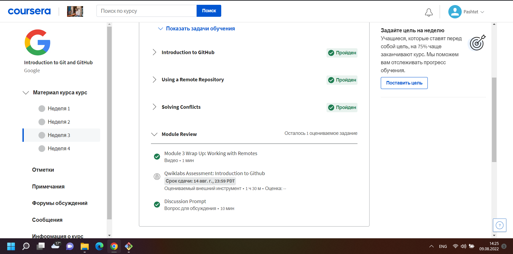
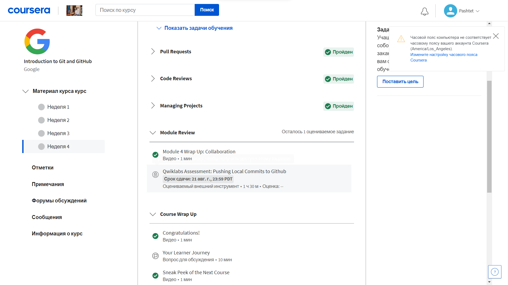
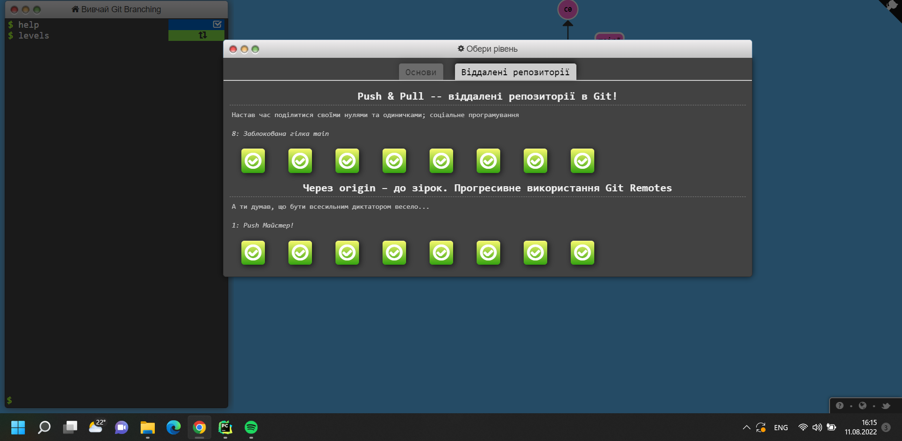

# kottans-frontend 2022 online courses
# Git та GitHub
Ознайомився з Git-ом курс на англійському був трішки складний але цікавий) Тому без проблем його пройшов.

# Learn Git Branching
Візуалізація у завданнях і прикладах сильно допомагає зрозуміти як в дрібницях працюють ті чи інші команди Git.

# Linux CLI, and HTTP
[Скріншоти на виконані завдання](http://sabaka.net)
1. Дізнався багато нових команд для управління лінуксом, думаю в подальшому пригодяться.
2. Було цікаво дізнатися як працюють коди Http та заголовки.
3. Інформація про реалізацію з'єднань Http та як використовують гешування в майбутньому стане у нагоді)

## Git Collaboration

В цьому розділі я:

 - Пройшов 3 та 4 тиждень курсу [Coursera](https://www.coursera.org/learn/introduction-git-github)
 

Скріншоти

- Пройшов Рівні на [learngitbranching.js.org](http://learngitbranching.js.org)

Скріншоти

> Хочу сказати що завдання у learngitbranching більш приємніші через візуалізацію але знання більш кращі дають на курсах від Courseera)
